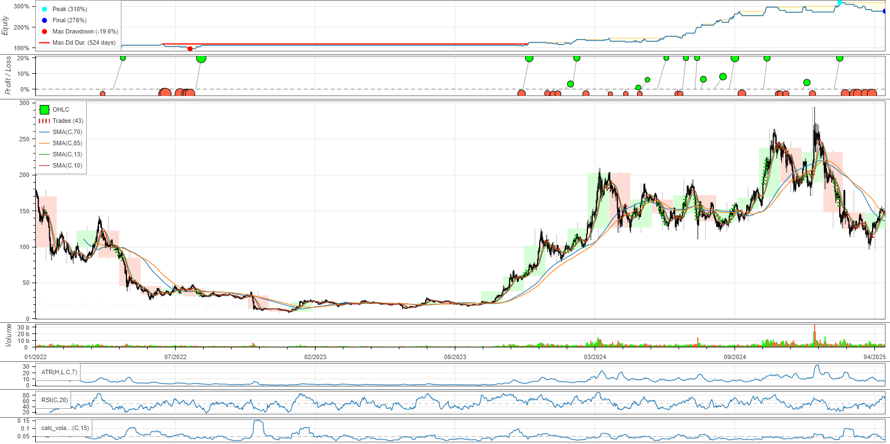

# Algorithmic Trading Bot

This project is an implementation of a laboratory work for the course "Software Bots and Agents for Stock Markets." It demonstrates the development and testing of an algorithmic trading strategy.

## Project Structure

The project is implemented in Google Colab and includes the following stages:

1.  **Data Access/Cleaning:** Fetching and cleaning historical market data for SOL-USD from Yahoo Finance.
2.  **Pre-trade Analysis:** Analyzing asset properties and defining indicators (SMA, ATR, RSI, Volatility) for the trading strategy.
3.  **Trading Signal & Trade Execution:** Developing the `AdvancedSmaStrategy` trading strategy based on moving averages, RSI, with dynamic position sizing and SL/TP. Backtesting and parameter optimization using the `backtesting.py` library and the `sambo` method.
4.  **Post-trade Analysis:** Analyzing strategy performance using metrics from `backtesting.py` and a detailed report generated by `quantstats`.

## Key Results

*   **Strategy Total Return:** +176% (vs. +31% for Buy & Hold SOL-USD).
*   **Compound Annual Growth Rate (CAGR):** +39.34% (vs. +9.15% for Buy & Hold).
*   **Max Drawdown:** -19.65% (vs. -91.88% for Buy & Hold).
*   **Sharpe Ratio:** 1.44 (vs. 0.6 for Buy & Hold).

The strategy demonstrated a significant outperformance of the benchmark with substantially lower risks.

## How to Run

1.  Open the `.ipynb` file in Google Colab.
2.  Install the necessary libraries (usually done at the beginning of the notebook via `!pip install ...`).
3.  Run the cells sequentially.

## Future Directions

*   Implement adaptive SL/TP based on ATR.
*   Integrate market sentiment analysis and fundamental factors.
*   Conduct extensive testing, including out-of-sample periods and other assets.